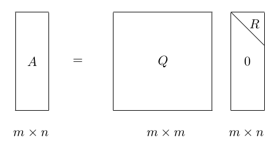
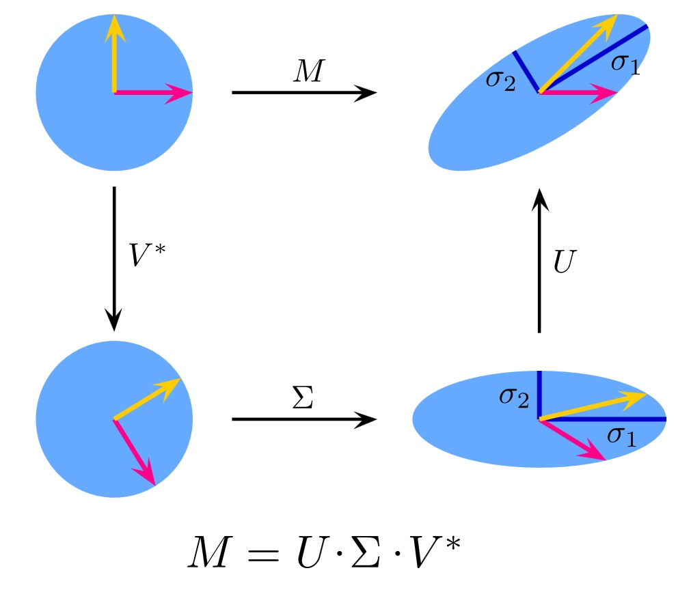
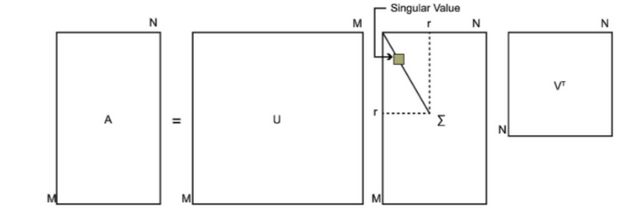
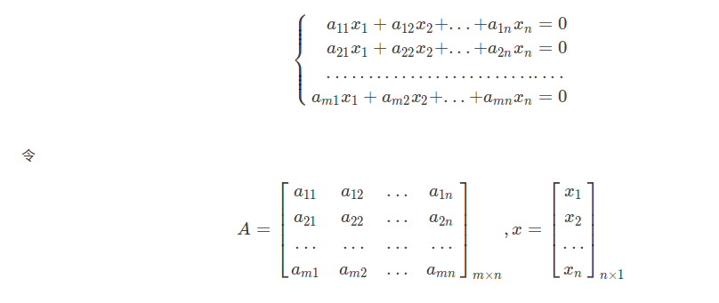
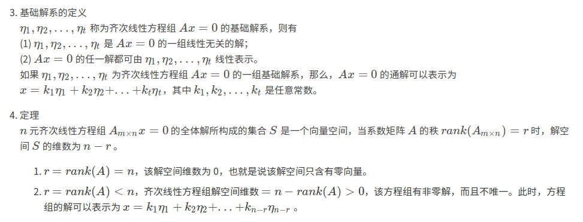
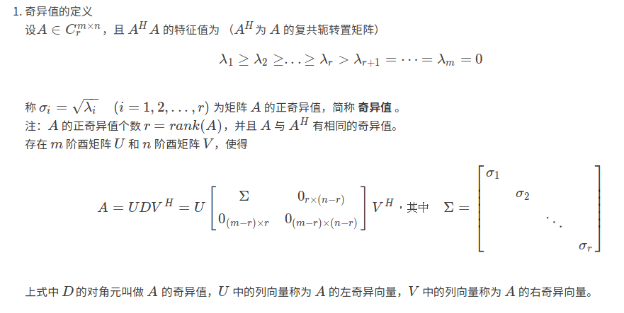
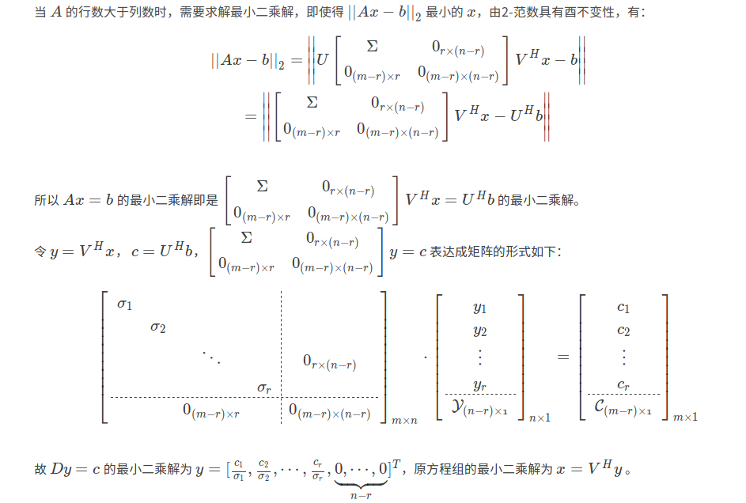
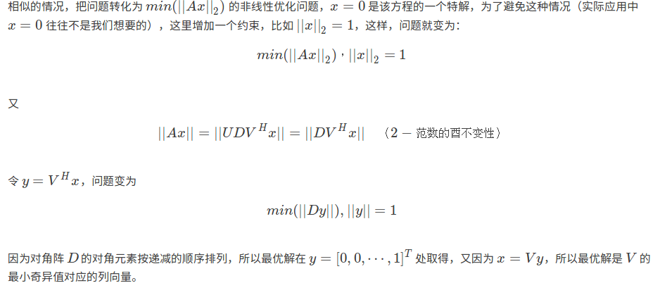

# 1. 相关概念
## 1.1. 正交矩阵
若一个方阵其行与列皆为正交的单位向量，则该矩阵为正交矩阵，且该矩阵的转置和其逆相等。两个向量正交的意思是两个向量的内积为 0
## 1.2. 正定矩阵
如果对于所有的非零实系数向量x ，都有 x'Ax>0，则称矩阵A 是正定的。正定矩阵的行列式必然大于 0， 所有特征值也必然 > 0。相对应的，半正定矩阵的行列式必然 ≥ 0。
## 1.3. 特征值与特征向量

其中Ａ是一个n*n矩阵，x是ｎ维向量，拉姆他是矩阵Ａ的一个特征值．
特征值分解可以用下式表示：  

  

其中W是这n个特征向量所张成的n×n维矩阵，而Σ为这n个特征值为主对角线的n×n维矩阵。
一般我们会把W的这n个特征向量标准化，即让Ｗ为正交矩阵．
注意到要进行特征分解，矩阵A必须为方阵。
那么如果A不是方阵，即行和列不相同时，我们还可以对矩阵进行分解吗？答案是可以，此时我们的SVD登场了。

# 2. SVD分解
# 3. LU分解
# 4. ＱＲ分解
QR 分解将一个矩阵分解一个正交矩阵 (酉矩阵) 和一个三角矩阵的乘积. QR 分解被广泛应
用于线性最小二乘问题的求解和矩阵特征值的计算.
QR分解也有若干种算法，常见的包括Gram–Schmidt、Householder和Givens算法。

QR分解是将矩阵分解为一个正交矩阵与上三角矩阵的乘积。用一张图可以形象地表示QR分解： 

## 4.1. NOTE
对于非方阵的阶矩阵A也可能存在QR分解。这时Q为m*m阶的正交矩阵，R为m*n阶上三角矩阵。这时的QR分解不是完整的(方阵)，因此称为约化QR分解(对于列满秩矩阵A必存在约化QR分解)。同时也可以通过扩充矩阵A为方阵或者对矩阵R补零，可以得到完全QR分解。

# 5. SVD分解

奇异值分解(Singular Value Decomposition，以下简称SVD)是在机器学习领域广泛应用的算法，它不光可以用于降维算法中的特征分解，还可以用于推荐系统，以及自然语言处理等领域。是很多机器学习算法的基石。
SVD也是对矩阵进行分解，但是和特征分解不同，SVD并不要求要分解的矩阵为方阵。假设我们的矩阵A是一个m×n的矩阵，那么我们定义矩阵A的SVD为：

## 5.1. UV矩阵求解
那么我们如何求出SVD分解后的U,Σ,V这三个矩阵呢？
如果我们将A的转置和A做矩阵乘法，那么会得到n×n的一个方阵$A^TA$那么我们就可以进行特征分解，得到的特征值和特征向量满足下式：

将$AA^T$的所有特征向量张成一个n×n的矩阵V，就是我们SVD公式里面的V矩阵了。一般我们将V中的每个特征向量叫做A的右奇异向量。
同理可通过下式求出Ｕ矩阵

U和V我们都求出来了，现在就剩下奇异值矩阵Σ没有求出了.

由于Σ除了对角线上是奇异值其他位置都是0，那我们只需要求出每个奇异值σ就可以了。

我们注意到:

## 5.2. 性质
对于奇异值,它跟我们特征分解中的特征值类似，在奇异值矩阵中也是按照从大到小排列，而且奇异值的减少特别的快，在很多情况下，前10%甚至1%的奇异值的和就占了全部的奇异值之和的99%以上的比例。

也就是说，我们也可以用最大的k个的奇异值和对应的左右奇异向量来近似描述矩阵。

也就是说：

由于这个重要的性质，SVD可以用于PCA降维，来做数据压缩和去噪。也可以用于推荐算法，将用户和喜好对应的矩阵做特征分解，进而得到隐含的用户需求来做推荐。同时也可以用于NLP中的算法，比如潜在语义索引（LSI）。
# 6. 特征向量分解
# 7. SVD分解
## 7.1. 齐次线性方程
方程组如下图所示：  

则方程组可以写成向量方程$Ax=0$
方程的解满足以下性质：
１若$x=a_1,x=a_2$为$$的解，则$x=a_1+a_2$也是$Ax=0$的解。
2若$x=a_1$为$$的解，k为实数则$x=ka_1$也是$Ax=0$的解。

## 7.2. SVD
### 7.2.1. 奇异值定义

### 7.2.2. SVD解方程
１解非齐次方程

２解齐次方程

# 8. 特征向量分解
# 9. 零空间
零空间：如果一个线性变换将空间压缩到低维度（比如一条直线）上，那么就有很多个向量在变换后落在原点。变换后，使得它们落在原点的向量的集合，称为“零空间”或者“核”。
在数学专业的词汇来表示线性变换后空间的维数, 称之为矩阵的秩( Rank ) . 换句话说, 列空间就是矩阵的列所张成的空间. 所以矩阵秩的另一种定义可以说是列空间的维数. 经过变换后被压缩到原点的向量集合, 称为矩阵 A 的"零空间"(Null Space)或"核"(Kernel), 记为 Null(A) 或 Ker(A). 

