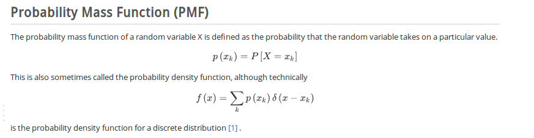
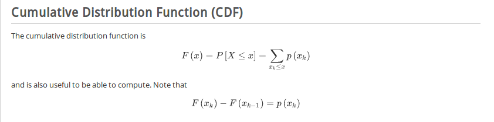
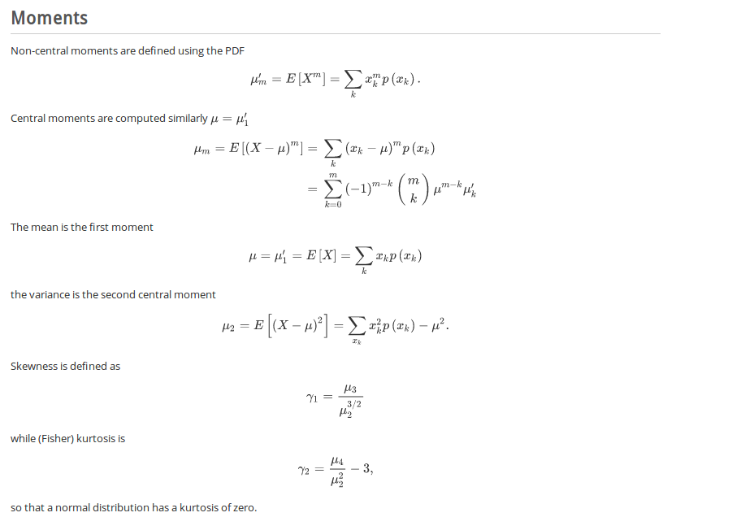

# 1. 概念
## 1.1. PMF
概率密度函数

## 1.2. CDF
积累分布函数

## 1.3. 矩


# 2. 离散分布
## 2.1. 二项分布
二项分布是很重要的离散分布之一，需满足两个条件：每次实验只能出现两种结果，Ｎ次实验是重复和独立的．

```
from scipy.stats import binom
import matplotlib.pyplot as plt
import numpy as np
fig, ax = plt.subplots(1, 1)
n, p = 5, 0.1
mean, var, skew, kurt = binom.stats(n, p, moments='mvsk')
rv = binom(n, p)
# 3. display the pmf
# 4. x = np.arange(binom.ppf(0.01, n, p), binom.ppf(0.99, n, p))
x = np.arange(0, 5)
ax.plot(x, binom.pmf(x, n, p), 'bo', ms=8, label='binom pmf')
ax.vlines(x, 0, binom.pmf(x, n, p), colors='b', lw=5, alpha=0.5)
ax.vlines(x, 0, rv.pmf(x), colors='k', linestyles='-', lw=1, label='frozen pmf')

plt.show()
```
## 2.2. 泊松分布
出现场合：当Ｘ表示在一定时间或者空间内出现的事件的个数．
poisson 分布是二项分布的极限逼近，当n比较大，而Ｐ又比较小时，此时拉姆他等于np.
# 3. 连续分布
＃ 高斯分布
