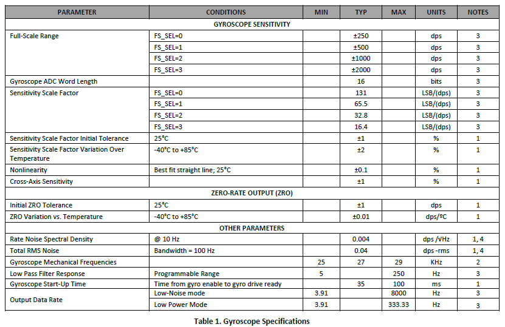
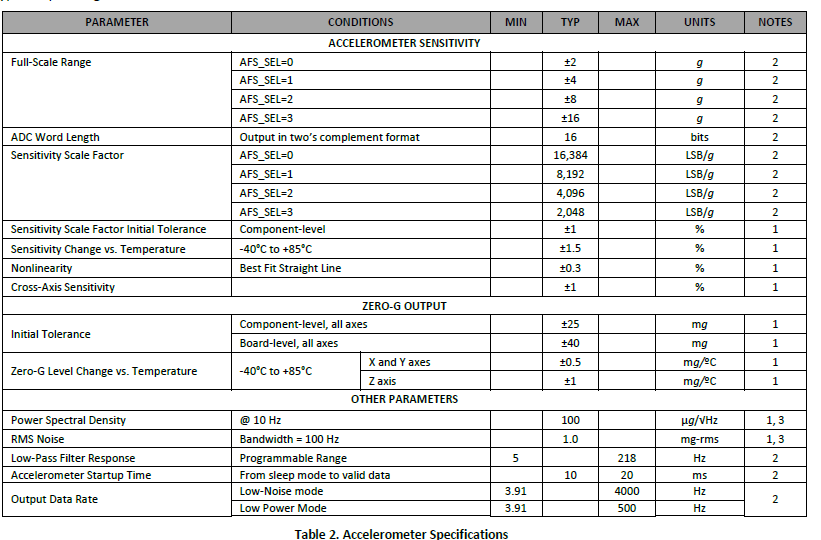
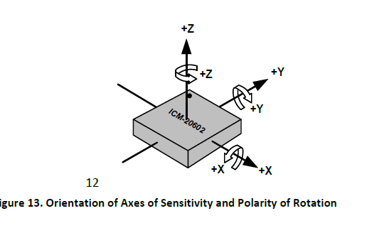
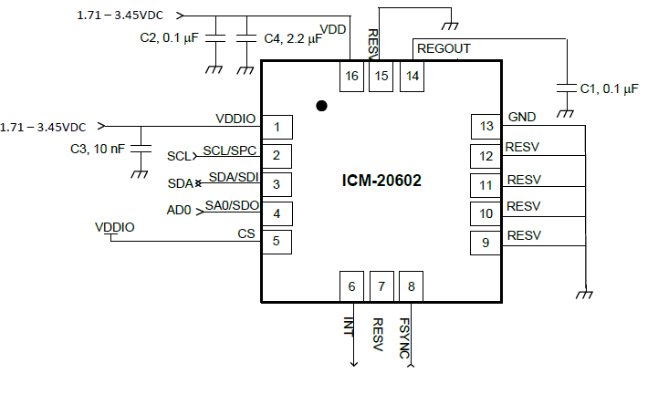
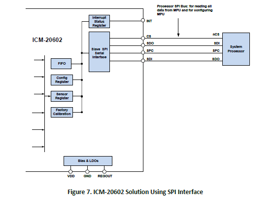
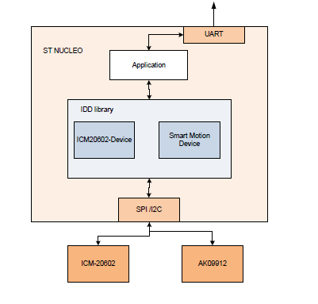
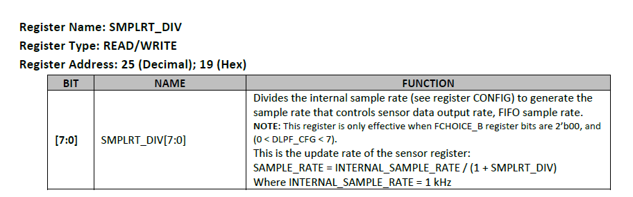

# 1. STM32开发
## 1.1. IMU型号
InvenSense公司的ICM-20602，现在被日本TDK公司收购
## 1.2. 特性
    1.陀螺仪 Gyroscope specification

    2. 加速度计 Accelerometer 

## 1.3. 芯片坐标系

## 1.4. 电路图

## 1.5. 通信接口
采用SPI接口，因为STM32系列的MCU的I2C有使用上的bug。

## 1.6. STM323F4应用

## ICM20602参数设置
### 采样频率
