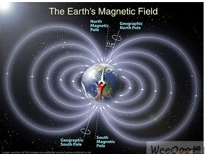

# 磁力计
## 工作原理
要实现电子罗盘功能，需要一个检测磁场的三轴磁力传感器和一个三轴加速度传感器。
如图1所示，地球的磁场象一个条形磁体一样由磁南极指向磁北极。在磁极点处磁场和当地的水平面垂直，在赤道磁场和当地的水平面平行，所以在北半球磁场方向倾斜指向地面。用来衡量磁感应强度大小的单位是Tesla或者Gauss（1Tesla=10000Gauss）。随着地理位置的不同，通常地磁场的强度是0.4-0.6 Gauss。需要注意的是，磁北极和地理上的北极并不重合，通常他们之间有11度左右的夹角。

## 世界坐标系

## 铁磁场干扰及校准
电子指南针主要是通过感知地球磁场的存在来计算磁北极的方向。然而由于地球磁场在一般情况下只有微弱的0.5高斯，而一个普通的手机喇叭当相距2厘米时仍会有大约4高斯的磁场，一个手机马达在相距2厘米时会有大约6高斯的磁场，这一特点使得针对电子设备表面地球磁场的测量很容易受到电子设备本身的干扰。

