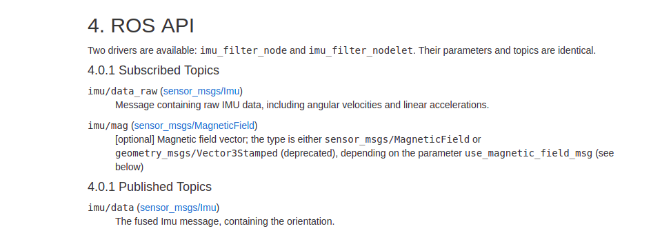

# intro
## ROS
在ros下操作，
madgwick 订阅的消息是 "/imu/data_raw",发布的消息是: "imu/data" 
操作如下:
```

rosrun USBsspu USBsspu_node
rosrun imu_filter_madgwick imu_filter_node _use_magnetic_field_msg:=false _publish_debug_topics:=true _use_mag:=false
rviz
```
